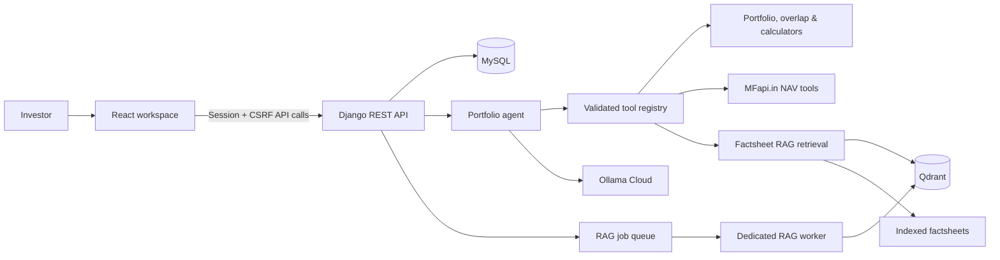

# Mutual Fund Portfolio Intelligence Agent

> **Mutual-fund intelligence for a clearer investment conversation.**

Mutual Fund Portfolio Intelligence Agent is a full-stack mutual-fund portfolio workspace. It brings together portfolio imports, holdings analysis, fund exploration, current NAV data, and evidence-backed factsheet research in one experience. Its agent chooses from bounded tools and returns the data sources behind its answers rather than inventing financial claims.


## Why this project?

Mutual-fund questions normally force investors to jump between statements, factsheets, NAV portals, and spreadsheets. This project connects those sources while preserving the distinction between portfolio data, public market data, and document evidence.

| Capability | What it does |
| --- | --- |
| Portfolio workspace | Imports holdings, shows allocations, overlap, sector exposure, and risk views. |
| AI portfolio chat | Uses purpose-built tools to answer portfolio and fund questions with an activity trail. |
| Fund document research | Searches indexed factsheets with page-level citations and confidence. |
| Fund Explorer | Searches schemes and compares NAV-based return, volatility, and drawdown metrics. |
| Account privacy | Uses Django sessions and CSRF protection; portfolio and chat data are scoped to the signed-in user. |

> [!IMPORTANT]
> This project is a research and education product, not investment advice. NAV and factsheet answers are only as current as their stated source and retrieval date.

---

## Product architecture



### How an answer stays grounded

1. The user asks through Portfolio Chat or **Fund document research**.
2. The agent selects only relevant validated tools; it cannot provide a user ID to a tool or access another user’s portfolio.
3. Factsheet requests resolve a fund scope and retrieve chunks from Qdrant.
4. Retrieved chunks retain source document and page metadata. The UI can show citations, confidence, and the answer method.
5. The RAG worker handles potentially slow document-answer jobs separately from ordinary web requests.

---

## Technology

| Layer | Technology |
| --- | --- |
| Web client | React, TypeScript, Vite |
| API | Django, Django REST Framework, drf-spectacular |
| Persistence | MySQL 8 |
| Retrieval | Docling ingestion, table-aware Markdown/chunks, Qdrant |
| AI | Ollama Cloud tool-calling model; optional vision fallback for difficult document extraction |
| Fund data | MFapi.in NAV and scheme data |
| Operations | Docker Compose, Gunicorn, WhiteNoise, health checks |

---

## Quick start

### 1. Prerequisites

- Docker Desktop / Docker Engine with Docker Compose
- Node.js **20.19+** or **22.12+** for the frontend
- An Ollama Cloud API key and a tool-calling model, such as `gemma4:31b`

### 2. Configure private environment values

From the repository root, create a private `.env` file:

```bash
cp .env.example .env
```

Set the required values. **Never commit this file.**

```dotenv
# Django
DJANGO_DEBUG=False
DJANGO_SECRET_KEY=generate-a-long-random-private-value
DJANGO_ALLOWED_HOSTS=localhost,127.0.0.1
DJANGO_CSRF_TRUSTED_ORIGINS=http://localhost:5173,http://127.0.0.1:5173

# MySQL
DB_NAME=portfolio_app
DB_USER=portfolio_user
DB_PASSWORD=choose-a-private-password
DB_HOST=127.0.0.1
DB_PORT=3306
MYSQL_ROOT_PASSWORD=choose-a-different-private-password

# Ollama Cloud
OLLAMA_API_KEY=your-ollama-cloud-key
OLLAMA_MODEL=gemma4:31b
OLLAMA_BASE_URL=https://ollama.com
OLLAMA_TIMEOUT_SECONDS=90
```

Generate a Django secret locally:

```bash
cd backend
python -c "from django.core.management.utils import get_random_secret_key; print(get_random_secret_key())"
cd ..
```

### 3. Start backend services

```bash
docker compose up --build -d
docker compose ps
curl http://127.0.0.1:8000/api/v1/health/
```

Expected response:

```json
{"status":"ok","service":"mutual-fund-portfolio-agent-api","database":"ok"}
```

Docker starts MySQL, Qdrant, the Django API, and the dedicated RAG worker. You do **not** need to start `runserver` or `run_rag_worker` separately when using Compose.

### 4. Start the frontend

```bash
cd frontend
npm ci
npm run dev
```

Open [http://localhost:5173](http://localhost:5173).

---

## Indexing fund documents

Add PDFs to the configured factsheet directory, then run indexing as a separate operation. Chat requests only query the existing collection—they do not parse PDFs during a user request.

With Docker running:

```bash
docker compose exec api python manage.py index_factsheets
```

For local, non-container development:

```bash
cd backend
python manage.py index_factsheets
```

The ingestion flow is:

```text
PDF → Docling (GPU when available) → table-aware Markdown → semantic chunks
→ embeddings + page metadata → Qdrant → scoped retrieval + citations
```

For details on chunking, evaluation, GPU configuration, and Ollama fallback, see [backend/rag/README.md](backend/rag/README.md).

---

## API reference

Interactive OpenAPI documentation is available while the API is running:

- [Swagger UI](http://127.0.0.1:8000/api/docs/)
- [OpenAPI schema](http://127.0.0.1:8000/api/schema/)
- [Health check](http://127.0.0.1:8000/api/v1/health/)

Key API groups:

| Group | Base path | Purpose |
| --- | --- | --- |
| Authentication | `/api/v1/auth/` | Signup, login, logout, profile, and CSRF initialization. |
| Portfolio chat | `/api/v1/chat/` | Authenticated portfolio questions, history, and agent responses. |
| Document research | `/api/v1/rag/` | RAG answer requests and asynchronous job status. |
| Portfolio & fund tools | `/api/v1/` | Imports, holdings, exposure, calculators, market data, and Fund Explorer endpoints. |

---

## Local development without Docker

Use this mode only when you already run MySQL and Qdrant locally.

```bash
# Backend
cd backend
python -m venv .venv
source .venv/bin/activate                # Linux/macOS
# .\.venv\Scripts\Activate.ps1             # Windows PowerShell
python -m pip install -r requirements.txt
python manage.py migrate
python manage.py runserver
```

In a separate terminal:

```bash
cd frontend
npm ci
npm run dev
```

For document jobs in local development, use a third terminal:

```bash
cd backend
source .venv/bin/activate
python manage.py run_rag_worker
```

---

## Deployment notes

The Compose stack is designed to sit behind an HTTPS reverse proxy. MySQL, Qdrant, and the API bind to `127.0.0.1` by default, so they are not directly publicly exposed.

For a public domain, update private `.env` values:

```dotenv
DJANGO_DEBUG=False
DJANGO_ALLOWED_HOSTS=portfolio.example.com
DJANGO_CSRF_TRUSTED_ORIGINS=https://portfolio.example.com
DJANGO_BEHIND_HTTPS_PROXY=True
DJANGO_SECURE_SSL_REDIRECT=True
DJANGO_HSTS_SECONDS=31536000
```

Enable HTTPS redirection and HSTS only after the reverse proxy has a valid TLS certificate. Do not enable HSTS preload or subdomain coverage unless every affected subdomain supports HTTPS.

### Operational checks

```bash
docker compose ps
docker compose logs --tail=100 api
docker compose logs --tail=100 rag_worker
curl http://127.0.0.1:8000/api/v1/health/
```

To stop services while preserving MySQL and Qdrant data:

```bash
docker compose down
```

---

## Security and reliability

- Secrets come from environment variables; `.env` files are ignored by Git.
- Django validates host and CSRF origins and uses secure cookies when debug is disabled.
- API rate limits, request validation, Pydantic-backed tool contracts, and bounded agent iterations reduce unsafe or runaway requests.
- The health endpoint verifies database readiness; Docker waits for it before starting the RAG worker.
- Qdrant uses a persistent Docker volume and is loopback-bound for local use.
- Factsheet answers retain page-level evidence; unsupported answers are withheld rather than presented as verified facts.

Before public launch, add email verification, password reset, login throttling, centralized logs/monitoring, backups, and a managed HTTPS reverse proxy.

---

## Testing

```bash
cd backend
source .venv/bin/activate
python manage.py test
pytest rag/tests tests -q
```

RAG evaluation is documented in [backend/rag/README.md](backend/rag/README.md). It measures retrieval, page citation accuracy, evidence coverage, grounding, confidence calibration, and latency against a controlled factsheet dataset.

---

## Repository guide

```text
backend/
├── accounts/          # Session authentication and profiles
├── app/               # Agent orchestration and registered tools
├── chat/              # Portfolio chat, RAG jobs, and response history
├── fundlens_rag/      # Reusable RAG service and retrieval bridge (package path)
├── portfolio_api/     # Portfolio, imports, market, explorer, calculators
├── rag/               # Ingestion, factsheets, evaluation, test corpus
└── config/            # Django settings and routes

frontend/
└── src/               # React workspace, chat, explorer, and dashboard UI

docker-compose.yml     # MySQL, Qdrant, API, and RAG worker services
```

## Contributing

1. Create a focused feature branch from current `main`.
2. Keep secrets, virtual environments, generated caches, and local data out of Git.
3. Add or update tests for behavior changes.
4. Run the relevant backend/frontend checks before opening a PR.
5. Describe data sources, limitations, and any user-visible financial assumptions in the PR.

---

Built for evidence-led mutual-fund research and portfolio understanding.
