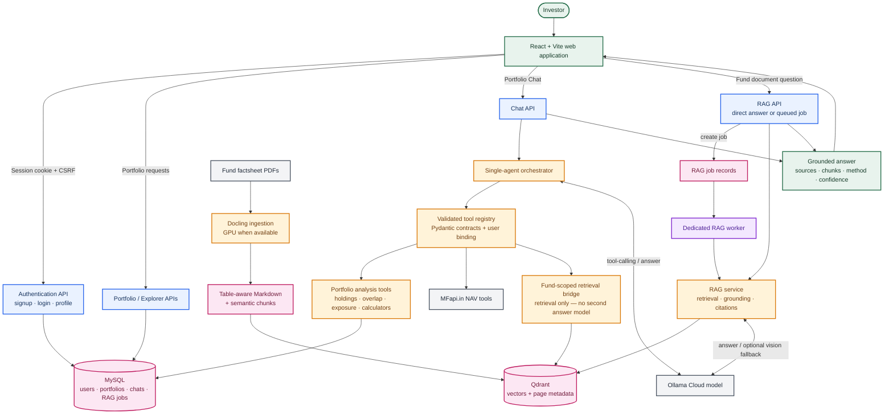
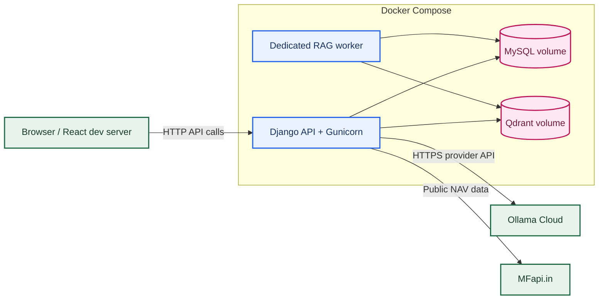
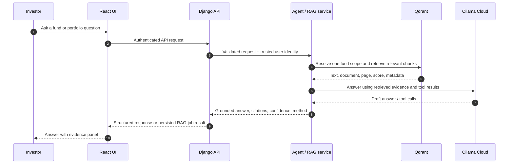

# System Architecture

This document is the submission-ready architecture diagram for the **Mutual Fund Portfolio Intelligence Agent**. It describes the deployed Django/React product, the tool-using portfolio agent, and the evidence-backed document-research path.

## Logical architecture

### Key data flows

| Flow | What happens | Safety / quality control |
| --- | --- | --- |
| Portfolio Chat | The agent selects from registered tools, then combines portfolio calculations, NAV data, or factsheet evidence into an answer. | Tool inputs are validated; the authenticated user identity is injected server-side rather than accepted from the model. |
| Fund document research | The API returns an answer directly or stores a RAG job; the worker processes longer jobs without holding the browser request open. | Fund scope, page metadata, citations, grounding checks, confidence, and retrieved chunks are preserved. |
| Document ingestion | A PDF is processed into table-aware Markdown and chunks before embeddings are stored in Qdrant. | Ingestion is separate from question answering, so user requests do not block on PDF parsing. |
| Fund Explorer | Public NAV data is retrieved from MFapi.in to compare funds independently of a user’s portfolio. | Exact scheme selection and source/date metadata help avoid ambiguous fund-plan answers. |

The agent’s `search_financial_documents` tool is deliberately **retrieval-only**.
It returns page-addressable chunks to the same agent turn; it does not invoke a
second answer-generating RAG model. The agent is the component that combines
those chunks with portfolio or NAV results.

---

## Container deployment architecture

### Runtime responsibilities

| Service | Responsibility | Readiness behavior |
| --- | --- | --- |
| `db` | MySQL data for accounts, portfolios, chats, and RAG job state. | Docker health check waits for the database account to respond. |
| `qdrant` | Persistent semantic index for factsheet chunks and metadata. | Stores 768-dimensional vectors plus text, PDF, page, fund, and publication metadata in a separate persistent service. |
| `api` | Django REST API, authentication, portfolio features, agent chat, direct RAG endpoint, and health endpoint. | Runs migrations/static collection, then Gunicorn; `/api/v1/health/` checks database readiness. |
| `rag_worker` | Claims queued RAG jobs and persists completed answers, evidence, citations, and usage. | Starts only after the API health check passes. |

> [!NOTE]
> In the provided Compose configuration, MySQL, Qdrant, and the API bind to `127.0.0.1` by default. A public deployment should place an HTTPS reverse proxy in front of the API and configure allowed hosts, CSRF origins, secure redirect, and HSTS through environment variables.

---

## Evidence path for a fund question

## Design principles

- **Evidence before assertion:** document answers carry source and page metadata.
- **Scoped retrieval:** fund questions resolve one indexed fund before querying the collection.
- **Separation of concerns:** ingestion, interactive API requests, and background RAG work are separate processes.
- **Least privilege:** browser identity is authenticated by Django; internal tool identity is bound server-side.
- **Operational resilience:** containers have health checks, persistent data volumes, environment-based configuration, and no committed secrets.

## API paths represented in this diagram

| Path | Role |
| --- | --- |
| `POST /api/v1/chat/` | Authenticated portfolio-agent conversation. |
| `POST /api/v1/rag/jobs/` | Queues a document-research request for the worker. |
| `GET /api/v1/rag/jobs/{job_id}/` | Returns RAG job status and the completed evidence-backed result. |
| `POST /api/v1/rag/answer/` | Direct/synchronous document-research answer. |
| `/api/v1/auth/` | Signup, login, logout, profile, and CSRF endpoints. |
| `/api/v1/health/` | Database-aware API readiness endpoint. |
